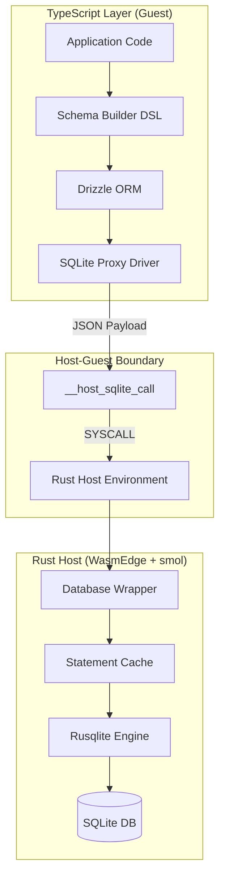

# SchemaScript

**SchemaScript** is a JavaScript-based Domain Specific Language (DSL) designed for defining database schemas with maximum type safety and developer experience. It serves as a high-level abstraction over Drizzle ORM, providing a fluent and declarative API within a secure, sandboxed Rust execution environment.

---

## Design Philosophy

1. **Secure by Default**: All fields are required (non-nullable) by default, unless explicitly modified as `.optional()`. This ensures the most restrictive and safest type set *(purest type lattice)* from the start.

2. **Declarative**: Describe *what* the data looks like, not *how* to create it.

3. **Fluent**: Use method chaining for a natural, readable syntax.

4. **Type-Safe**: Leverage TypeScript's powerful type system to provide autocomplete and catch errors at compile-time.

---

## Core API

### Schemas and Tables

Schemas are defined using the `Schema` function. It takes a name and a schema definition.

Tables are generated from schema definitions via the `Table` function. It takes the same SchemaBuilder and returns a Drizzle ORM table instance directly.

```typescript
import type { SchemaBuilder } from "@artefact/schemascript";
import { Schema, Table, value } from "@artefact/schemascript";

const User: SchemaBuilder = (prop) => ({
  id: prop.integer().identifier(),
  username: prop.text().unique(),
  email: prop.text().optional(),
  createdAt: prop.timestamp().default(value.now()),
})
const UserSchema = Schema("User", User);
const UserTable = Table("User", User);

export { User, UserSchema, UserTable }
```

---

### Data Types

SchemaScript provides 7 core primitive data types:

| SchemaScript Type | Description / Usage | JS Type | SQLite Type |
| :--- | :--- | :--- | :--- |
| `integer` | Whole number integer values | `bigint` | `INTEGER` |
| `real` | Floating-point real numbers | `number` | `REAL` |
| `text` | Textual string data | `string` | `TEXT` |
| `blob` | Binary data | `Uint8Array` | `BLOB` |
| `timestamp` | Dates and times | `Date` | `INTEGER` |
| `node` | Structured objects and documents | `object` | `BLOB` (JSON) |
| `enum` | Performant, type-safe enumerations | `string` (union) | `INTEGER` |

---

### Modifiers

All properties support the following modifiers through method chaining:

- `.identifier()`: Marks the column as a primary key
- `.optional()`: Allows the column to be null (escape hatch from the pure type lattice)
- `.unique()`: Adds a unique constraint
- `.default(value)`: Sets a default value for the column
- `.array()`: Marks the column as an array of multiple values. SQLite natively lacks array types, so SchemaScript automatically handles JSON serialization for arrays of any primitive type.

**Note**: All fields are **required** (non-nullable) by default. Use `.optional()` to allow null values.

---

### Relations

Define foreign key relationships using a fluent API.

```typescript
const Posts = Table("posts", (prop) => ({
  id: prop.integer().identifier(),
  authorId: prop.integer().references(() => Users.id),
}));
```

---

### Enums

First-class support for performant enums. Enums can be defined using an array of strings or a mapping object. To ensure maximum query performance, all enums are stored as `integer` columns in the database while maintaining their string representations in the application layer.

```typescript
const Profile = Schema("profiles", (prop) => ({
  role: prop.enum("role", { options: ["admin", "user", "guest"] }).default("guest"),
  status: prop.enum("status", { options: { ACTIVE: 1, INACTIVE: 0 } }).default("ACTIVE"),
}));
```

---

### TypeScript Generation

SchemaScript can generate standard TypeScript interfaces from your schema definitions.

```typescript
const userInterface = Users.toTypeScriptInterface();
/*
interface Users {
  id: bigint;
  username: string;
  email: string | null;
  createdAt: Date;
}
*/
```

---

### Custom Types

Easily extend SchemaScript with custom database types.

```typescript
const Custom = Schema("custom", (prop) => ({
  data: prop.custom<MyType>("my_custom_type"),
}));
```

---

## Architecture

The project is architected in three main domains, ensuring a hard boundary between high-level definition and low-level execution.

### 1. SchemaScript DSL (JavaScript)

A type-safe, fluent API for defining database schemas with SQLite-optimised primitives (`integer`, `real`, `text`, `blob`, `timestamp`, `node`, `enum`).

- **Immutability**: Every property modifier (`.optional()`, `.default()`, `.unique()`) returns a new instance
- **Secure by Default**: All fields are non-nullable unless explicitly marked `.optional()`
- **Drizzle Integration**: Definitions are automatically translated into `drizzle-orm` compatible column builders
- **Inferred Metadata**: Column names are automatically inferred from object keys

### 2. High-Performance Runtime (Rust Host)

A secure execution environment leveraging **WasmEdge** and **smol** for ultra-fast, lightweight sandboxing.

- **Sandbox**: Powered by **WasmEdge** (v0.13), optimised for edge computing cold-starts.
- **Async Strategy**: Uses the **smol** runtime for a minimal binary footprint and high concurrency.
- **Guest Engine**: Embedded **rquickjs** (QuickJS) provides a familiar JavaScript execution environment inside the WASM sandbox.
- **Native Backend**: **Rusqlite** handles queries with native hardware acceleration and WAL-mode optimisations.

### 3. The SYSCALL Bridge

Uses `drizzle-orm/sqlite-proxy` to capture SQL queries and serialise them across the Host-Guest boundary.

---

## 🛰️ System Architecture



---

## Tech Stack

- **Runtime**: [WasmEdge](https://wasmedge.org/) (High-performance WASM)
- **Executor**: [smol](https://github.com/smol-rs/smol) (Lightweight async)
- **JS Engine**: [rquickjs](https://github.com/DelSkayn/rquickjs) (Rust bindings for QuickJS)
- **Database**: [Rusqlite](https://github.com/rusqlite/rusqlite) (Native SQLite)
- **ORM**: [Drizzle ORM](https://orm.drizzle.team/) (TypeScript Type-Safety)

---

## Prerequisites

To build and run the native host, you must have the **WasmEdge** development libraries installed on your system.

**macOS**:

```bash
brew install wasmedge
```

**Linux**:

```bash
curl -sSf https://raw.githubusercontent.com/WasmEdge/WasmEdge/master/utils/install.sh | bash
```

---

## Getting Started

### 1. Define Your Schema

Use the fluent API to define type-safe database tables:

```typescript
import { Schema, type SchemaBuilder, Table } from './data/core';

const users: SchemaBuilder = (prop) => ({
  id: prop.integer('id').identifier(),
  name: prop.text('name'),
  avatar: prop.blob('avatar').optional(),
});

const usersSchema = Schema('users', users);
const usersTable = Table('users', users);
```

**Key Points**:

- All fields are **required** (non-nullable) by default
- Use `.optional()` to allow null values
- Column names are automatically inferred from object keys
- `.identifier()` marks a field as the primary key

### 2. Build the Runtime

```bash
cd runtime
cargo build --release
```

### 3. Run the Secure Host

The host provides a secure environment where user logic is isolated from the file system, only accessing data via designated SYSCALLs.

---

## Security & Performance

- **Memory Isolation**: Guest code cannot access host memory directly.
- **Resource Constraints**: WasmEdge allow us to limit CPU and Memory usage per context.
- **Native SQL**: Prepared statements are cached natively in Rust, avoiding repeated parsing overhead.
- **WAL Mode**: Enabled by default for high-concurrency write workloads.
